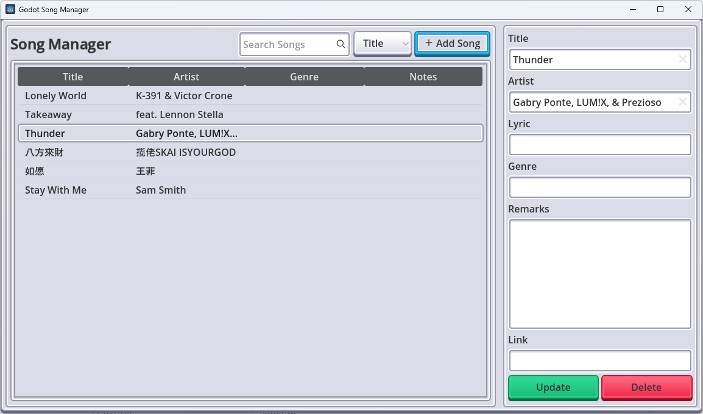

# 🎵 Godot 音乐记录器（Music Manager）

一个基于 Godot 引擎开发的 **本地化音乐信息管理工具**，用于记录和检索你最爱的歌曲信息，支持拼音搜索、逻辑字段筛选、软删除等功能。



本项目使用 [Godot SQLite 插件](https://godotengine.org/asset-library/asset/1686) 存储数据，界面采用 [Kenney UI Pack](https://www.kenney.nl/assets/ui-pack) 构建，兼具实用性与美观性 💡

---

## ✨ 项目特性

- ✅ 支持增删改查本地歌曲资料
- 🔍 实现模糊匹配搜索（支持拼音/中文/英文混输）
- 🧠 表单字段实时提醒：避免重复添加
- 🗂️ 分类字段支持：曲名、歌手、风格、备注等
- 🗑️ 支持软删除（数据仍保存在数据库中）
- 🕐 记录每首歌的插入与更新时间戳
- ⚙️ 支持开发者工具按钮：一键刷新 UI

---

## 📦 使用资源

| 名称                  | 类型       | 链接                                                                 |
|---------------------|----------|----------------------------------------------------------------------|
| Godot SQLite Plugin | 插件       | [Godot Asset #1686](https://godotengine.org/asset-library/asset/1686) |
| Kenney UI Pack      | UI 素材包   | [Kenney.nl](https://www.kenney.nl/assets/ui-pack)                   |

---

## 🚀 快速开始

### ✅ 环境要求

- Godot Engine 4.x+

### 🛠️ 运行步骤

1. 克隆项目或下载源码：
   ```bash
   git clone https://github.com/yourusername/godot-music-manager.git
   ```
2. 在 Godot 中打开项目。
3. 项目首次运行时将初始化数据库（位于 `res://song_manager`）。
4. 点击运行按钮开始管理你的音乐清单。

---

## 🧱 数据结构

该项目将所有歌曲信息保存在本地 SQLite 数据库，表名为 `songs`，表结构如下：

| 字段名                  | 类型   | 描述         |
| -------------------- | ---- | ---------- |
| song\_id             | int  | 主键，自增      |
| song\_title          | text | 歌名         |
| song\_title\_pinyin  | text | 歌名拼音（搜索用）  |
| song\_artist         | text | 歌手         |
| song\_artist\_pinyin | text | 歌手拼音（搜索用）  |
| song\_lyric          | text | 歌词片段       |
| song\_genre          | text | 曲风         |
| song\_genre\_pinyin  | text | 曲风拼音（搜索用）  |
| song\_remark         | text | 备注信息       |
| song\_link           | text | 外部链接（如 MV） |
| inserted\_datetime   | text | 创建时间       |
| updated\_datetime    | text | 更新时间       |
| deleted              | int  | 是否已删除（软删）  |
| deleted\_datetime    | text | 删除时间       |

---

## 🖥️ 核心功能说明

### 🎼 添加/编辑歌曲

* 用户可在 UI 中输入歌曲各字段。
* 若已选择列表中某一条，则进行更新；否则为新增。
* 插入/更新时间自动生成。

### 🔍 搜索功能

* 用户可选择搜索范围：
	* 歌名 / 歌手 / 曲风
* 支持中文、英文、拼音模糊匹配。

### 🗑️ 删除机制

* 删除为软删除：数据库字段 `deleted=1`。
* 保留数据以防误删，支持未来恢复机制（可扩展）。

### ⚙️ Dev Refresh 按钮

* 仅开发模式可见。
* 一键设置/重置 TreeView 的列标题，方便调试。

---

## 🔧 开发者说明

主要脚本模块：

* `Database.gd`: 数据库封装操作，包括 CRUD 与查询封装。
* `SongManagerPanel.gd`: 主面板控制器，处理 UI 输入与状态更新。
* `Song.gd`: 数据结构定义（未贴出，可自行实现 `from_dict()` 与 `to_dict()`）

---

## 📌 TODO / 可扩展功能建议

* [ ] 导入 / 导出 CSV
* [ ] 本地封面图片支持
* [ ] 歌词全文显示与搜索
* [ ] 收藏 / 标签 / 分组机制

---

## 🧑‍💻 作者

**小麦** — [GitHub](https://github.com/kingsmai)
🎮 前端开发者 / 游戏开发爱好者 / Minecraft Lover

---

## 📜 License

本项目以 [MIT License](./LICENSE) 授权发布。

---

💬 *如果你喜欢这个项目，欢迎 Star / Fork / 提出 Issue 与建议！音乐值得被记录，每一首歌，都是回忆的入口。*
