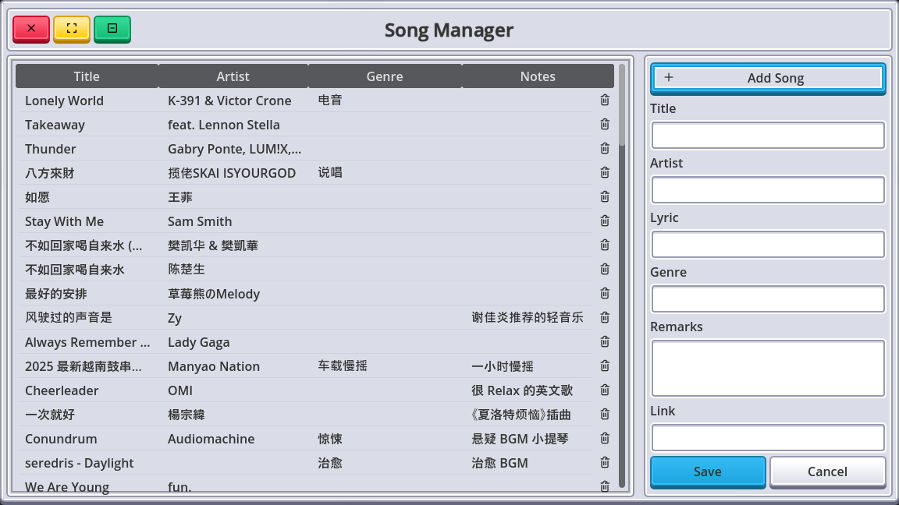

# 📢 更新日志 — v1.1.0.0

📦 **Godot 音乐记录器（Music Manager）** 迎来 **v1.1.0.0** 版本更新！本次更新在视觉体验、窗口操作、搜索效率与排序逻辑等多个维度进行了增强，为你带来更加顺滑、专业的本地音乐管理体验 🎶✨

---

## 🚀 新增功能与优化内容

### 🪟 窗口控制功能上线

* 新增窗口操作按钮：关闭、最小化、最大化。
* 实现自定义窗口控制逻辑，兼容多平台窗口行为。
* 引入全新 SVG 图标素材，界面更美观、交互更自然。

### 🎵 歌曲管理增强

* ✨ 支持按以下字段进行排序：

  * 歌名（Title）
  * 歌手（Artist）
  * 曲风（Genre）
* 排序操作基于点击列标题，响应快速，逻辑直观。

### 🔍 搜索体验优化

* 动态过滤机制：搜索输入实时更新匹配结果。
* 支持更灵活的模糊匹配方式，搜索更准确高效。

### 🛠️ 数据与性能提升

* 更新数据库查询语句，优化复杂查询时的性能表现。
* 提高字段筛选与软删除逻辑的执行效率。

### 📄 文档更新

* 增加 `Release Notes` 说明文件，记录功能变更与开发规划。
* 更新项目版本与显示配置，便于版本控制与发布管理。

---

## 🧭 版本展望

> v1.1.0.0 是向「可用性 + 可扩展性」迈出的关键一步，未来将重点探索以下方向：

* [ ] 收藏 / 标签系统，实现个性化分类
* [ ] 歌词全文支持 + 高亮搜索
* [ ] 数据导出 / 导入（CSV / JSON 等格式）
* [ ] 本地封面图片管理与缓存机制

---

🎧 本地音乐记录，不止于存储，更是一种整理回忆的方式。欢迎大家持续关注项目进展，也欢迎提出反馈与建议，让我们一起把音乐的世界变得更有条理、更有温度 💡
